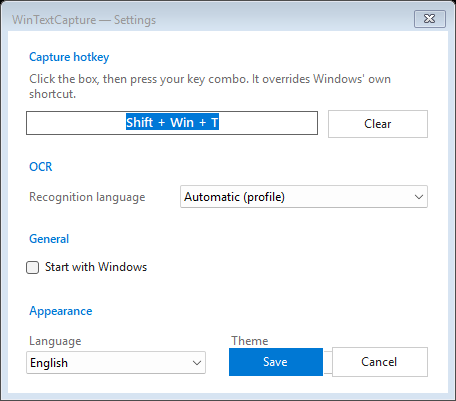
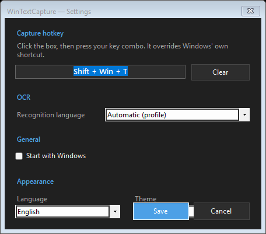

<p align="center">
  
</p>

<h1 align="center">WinTextCapture 📋🔎</h1>

<p align="center">
  A lightweight Windows tray utility for copying text from anywhere on screen.<br>
  Press the hotkey, drag over text, release — the recognized text is on your clipboard.
</p>

<p align="center">
  <a href="https://github.com/ydbilgin/WinTextCapture/releases/latest"></a>
  <a href="https://github.com/ydbilgin/WinTextCapture/releases"></a>
  
  
  <a href="LICENSE"></a>
</p>

<p align="center">
  
  
</p>

Press the hotkey, drag over text, release the mouse button, and the recognized text is copied to the clipboard. It is intended as a lightweight alternative to installing all of PowerToys just for Text Extractor — native Windows OCR, no cloud, no account.

## Features

- 🔎 **Native Windows OCR** — uses `Windows.Media.Ocr`, fully offline. No cloud, no account, no API key.
- ⌨️ **Global hotkey** — press `Win + Shift + T` from anywhere, drag a box over the text, release, done.
- 🖥️ **Multi-monitor selection overlay** — grab text on any screen; mixed-DPI aware.
- 🌍 **OCR language picker** — choose from the OCR languages installed in Windows, ideal for non-English text.
- 🔬 **Small-text preprocessing** — upscales tiny selections before OCR for sharper recognition on compact UI and games.
- 📋 **Reliable clipboard** — every write is retried and verified, so you never paste stale text.
- 🔔 **Toast feedback** — a short preview of what was copied, or a clear note when nothing readable was found.
- 🚀 **Quiet & light** — optional start with Windows, single instance, tray-only, and light / dark / system themes.

## Install

### Option A — download a release
1. Grab the latest **`WinTextCapture.exe`** from the **[Releases page](https://github.com/ydbilgin/WinTextCapture/releases/latest)**.
2. Run it — it lives in the system tray, no installer. The build is standalone, so no .NET runtime is required.

### Option B — build from source
You'll need the **.NET 9 SDK** on Windows 10/11.

```powershell
git clone https://github.com/ydbilgin/WinTextCapture.git
cd WinTextCapture
dotnet build -c Release

# standalone single-file exe (bundles the runtime)
dotnet publish -c Release -r win-x64 --self-contained true -p:PublishSingleFile=true
```

## Usage

1. Start `WinTextCapture.exe`.
2. Use `Win + Shift + T`.
3. Drag a rectangle over the text you want to copy.
4. Release the mouse button.
5. Paste with `Ctrl + V`.

If OCR succeeds, the app shows a small toast such as `Copied: ...`. If no readable text is found or the clipboard does not change, the toast says so explicitly.

## OCR Languages

WinTextCapture uses Windows' built-in OCR engine. It can only recognize languages that have OCR support installed in Windows.

Open **Settings** from the tray menu and choose the OCR language that matches the text you capture. For games or apps using English UI text, selecting `English (en-US)` is usually better than `Automatic`.

To see or install OCR language packs on Windows, use Windows language settings or the PowerShell capability commands documented by Microsoft for Windows OCR language packs.

## Hotkey Notes

The default hotkey is `Win + Shift + T`.

The app uses a low-level keyboard hook so it can consume the shortcut before the Windows or PowerToys handler in most normal cases. If PowerToys Text Extractor is also enabled with the same shortcut, hook order can still cause conflicts. Disable or change the PowerToys Text Extractor shortcut if both tools are installed.

## Testing

The hotkey state machine and capture-message formatting are covered by lightweight, dependency-free tests:

```powershell
dotnet run --project tests\WinTextCapture.Tests\WinTextCapture.Tests.csproj
```

## Project Structure

- `TrayApplicationContext.cs` owns the tray icon, menu, settings, capture trigger, and result feedback.
- `KeyboardHook.cs` installs the global low-level keyboard hook.
- `KeyboardHookState.cs` contains the testable hotkey state machine.
- `OverlayForm.cs` handles screen capture, selection, OCR, and clipboard write flow.
- `OcrImagePreprocessor.cs` upscales small selections before OCR.
- `ClipboardWriter.cs` retries and verifies clipboard writes.
- `SettingsForm.cs` provides the small Windows Forms settings UI.
- `tests/WinTextCapture.Tests` contains lightweight regression tests without external test packages.

## License

[MIT](LICENSE)
